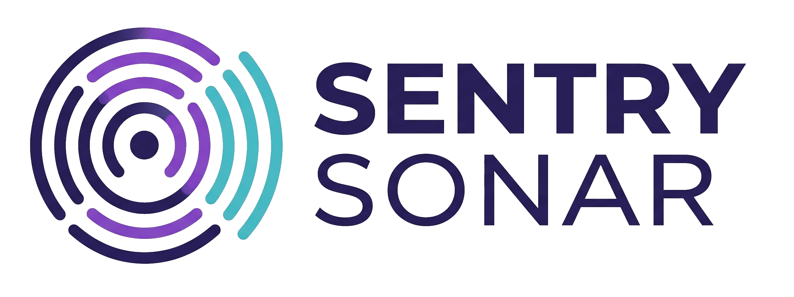

<p align="center">
  
</p>

# Sentry Sonar

Real-time meeting-room availability, sensed by radar and shown right on the door.

## What it does

A 24GHz radar sensor in each room detects human presence — *that* a person is
there, never *who* (no cameras, no microphones) — and reports to a Cloudflare
Workers API. Two consumers read that data:

- **E-ink door displays** show **FREE / OCCUPIED** at a glance. Battery-powered,
  they deep-sleep and poll during office hours, running ~1–2 weeks per charge.
- **A web dashboard** gives a live overview of every room, plus how they're used
  over time (utilization, busy hours).

**The outcome:** walk down the hall and see which rooms are free without opening a
calendar or a booking app — and see room-usage trends on the dashboard. Privacy by
design: radar only knows presence, not identity.

## Architecture

```
 Sensor node (Freenove ESP32 + LD2410C radar) ──POST /events──►  Cloudflare
                                                                  Worker (Hono)
 Display node (Waveshare e-paper)  ──GET /rooms/:id──►            + D1
 Dashboard (React SPA)             ──GET /rooms─────►             + static assets
```

Two nodes per room: a mains-powered **sensor node** that senses continuously, and a
battery **display node** that deep-sleeps and polls during office hours. A single
Cloudflare Worker (Hono) on D1 holds current room state plus an append-only event
log **and** serves the dashboard (React SPA) as static assets — same origin, one URL.

## Repo layout

```
firmware/sensor-node/    Freenove + LD2410C radar (PlatformIO)
firmware/display-node/   Waveshare e-paper (GxEPD2 + deep sleep)
api/                     Cloudflare Worker (Hono) + D1 migrations
dashboard/               React SPA (Vite) — served by the Worker as static assets
```

## Docs

- **[SETUP.md](./SETUP.md)** — step-by-step to stand up your own copy end to end
  (Cloudflare backend, dashboard, device tokens, firmware).
- **[PLAN.md](./PLAN.md)** — design, data model, API surface, and the decisions
  behind them.
- **[api/README.md](./api/README.md)** — API endpoints, deploy & operate, tokens.
- **[firmware/README.md](./firmware/README.md)** — flashing sensors & displays,
  board pinouts, and the battery/power gotchas.

## Status

Hackweek project — 4 rooms, 4 device kits, all provisioned and running.

- App — dashboard + API on one Worker:
  <https://sentry-sonar-api.francesconovy.workers.dev> (the dashboard is at the
  root path; its data only loads from an allowlisted office IP)
