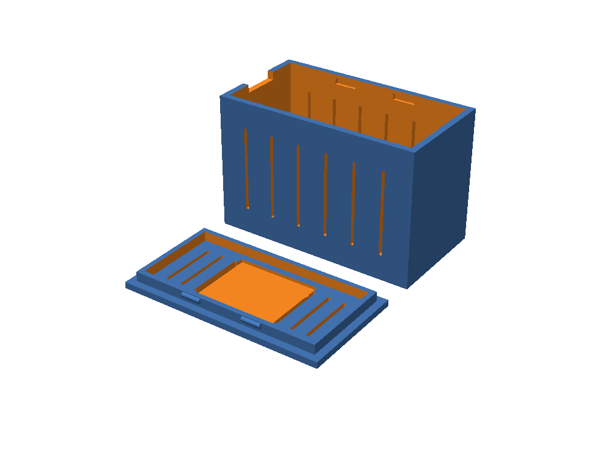

# Sensor-node enclosure

3D-printable case for the **sensor node** (ESP32-S3 + LD2410C 24 GHz radar). A
box with a **snap-fit lid**: rounded beads on the lid lip click into pockets in
the body walls, and a thumbnail pry notch pops it back open. The radar antenna
faces the lid, which has a thinned "window" panel so the 24 GHz signal passes
through.



Everything is generated from one parametric source, `sensor-node-box.scad`.

| File | What it is |
|---|---|
| `sensor-node-box.scad` | The parametric source — edit this, never the STLs |
| `sensor-node-box-body.stl` | Rendered box (print 1×) |
| `sensor-node-box-lid.stl` | Rendered lid (print 1×) |
| `preview.png` | 3/4 render for the docs |
| `render.sh` | Regenerates both STLs + the preview from the `.scad` |

Internal cavity is **60 × 30 × 40 mm** (L×W×H); 2 mm walls give a ~64 × 34 × 44 mm
outer size. There's a 22 mm-wide USB-C slit on one short side (room for two
connectors) and vent slits on the long walls and the lid.

## Printing

- **Filament: PLA or PETG only.** Both are radar-transparent. **Never** use
  carbon-fibre- or metal-filled filament — the 24 GHz radar won't see out.
- Print **body** and **lid** each once. Both are oriented to print flat with no
  supports: the body sits floor-down (open top up), and the lid prints
  plate-down with its locating lip pointing up (flip it to assemble). The radar
  window is thinned from the *inside*, so the outer face stays flush.
- 0.2 mm layers, ~3 perimeters, 15–20 % infill is plenty.

## Regenerating STLs and the preview

Run everything through the helper:

```sh
./render.sh
```

Or invoke OpenSCAD directly (tested with **OpenSCAD 2021.01**,
`brew install --cask openscad`). Render one part per STL:

```sh
openscad -D 'part="body"' -o sensor-node-box-body.stl sensor-node-box.scad
openscad -D 'part="lid"'  -o sensor-node-box-lid.stl  sensor-node-box.scad
```

Preview image (blue body / orange interior via the built-in **Tomorrow** color
scheme; angled so both the body and the lid's top — radar window + snap beads —
are visible):

```sh
openscad -D 'part="all"' --colorscheme=Tomorrow --imgsize=1000,750 \
  --camera=32,39,12,60,0,215,320 -o preview.png sensor-node-box.scad
```

The `--camera` args are `look-at x,y,z` + `rotation x,y,z` + `distance`.

> **Pure-white background.** OpenSCAD has no pure-white built-in scheme
> (`Tomorrow`'s background is `#f8f8f8`) and the app bundle is SIP-protected, so a
> custom scheme can't be dropped in. `render.sh` therefore does a small post-step:
> it floods the flat near-white field to `#ffffff` with Pillow. That's the only
> reason the checked-in `preview.png` is truly white. If Pillow isn't installed
> the render still works — you just keep the `#f8f8f8` background (visually white
> anyway). To get Pillow without touching system Python:
> `python3 -m venv /tmp/v && /tmp/v/bin/pip install Pillow`, then run `render.sh`
> with `/tmp/v/bin` on PATH.

## Tuning the lid fit

The snap-fit is governed by a few parameters near the top of the `.scad`. Two
independent things control how the lid feels:

| Parameter | Default | Controls |
|---|---|---|
| `tol` | `0.3` | Lip clearance — gap per side between lid lip and cavity walls. **Lower = less side-to-side wobble.** |
| `detent_r` | `0.8` | Snap-bead radius. **Higher = firmer click.** |
| `pocket_h` | `2.0` | Catch-pocket height; must clear the bead (`2 × detent_r`) plus a little. |

The retention that actually stops the lid lifting off is the **bead
interference** = `detent_r − tol` (currently `0.8 − 0.3 = 0.5 mm`). Note that
lowering `tol` tightens the lateral fit *and* raises the interference, so the two
levers interact.

- Lid **pops loose / falls off** → raise `detent_r` (try `0.9`), and/or lower
  `tol`. Bump `pocket_h` if `detent_r` grows.
- Lid **too stiff to close, or beads shear** → lower `detent_r` (try `0.7`), or
  raise `tol` back toward `0.4`.
- Lid **rattles** side to side but holds → lower `tol` only.

0.5 mm interference on the 1.6 mm lip wall is firm-but-pry-openable in PLA/PETG
on a typical 0.4 mm nozzle. Printers that run tight may want `detent_r = 0.7`.
Beads and pockets are symmetric in X and Y, so the lid latches whichever way it's
flipped. Re-run `./render.sh` after any change.
